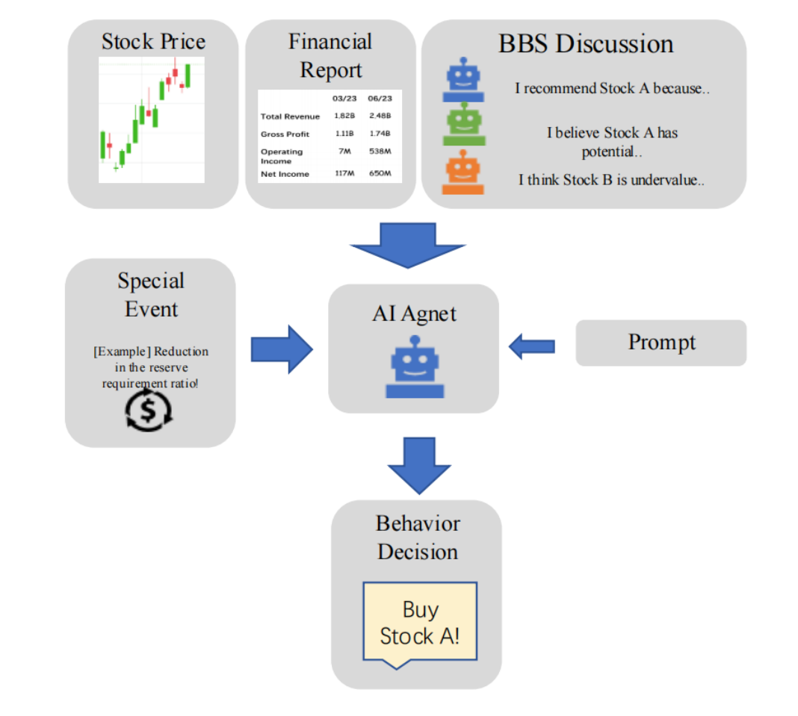

# SmartAgent: Multi-agent-based [S]imulation of Real-world Stock [Mar]ket [T]rading

## Introduction
Please see the [report](SmartAgent_Report.pdf) to get to know this project.

This diagram illustrates how a trading agent makes its own trading decisions.


And the entire trading simulation process includes three modules: Investment Module, Transaction Module, and BBS Module.

### Investment Module
Investment Module, is designed for simulating heterogeneous investor behaviors in financial markets. It includes functions like Interest Repayment, Bankrupt Check, Loan Decision and so on. We design it firstly by initializing each AI agent with randomized capital between 100,000 to 5 million units and assign one of four distinct trading personalities: conservative, aggressive, balanced, or growth-oriented. The system incorporates authentic market constraints: variable interest loans from
2.7% to 3.3%, and mandatory bankruptcy procedures when cash turns negative. The breakthrough here is our LLM-powered decision core. Using either GPT or Gemini, agents process real-time market data, financial reports, and BBS discussions to generate JSON-formatted trading decisions.

### Transaction Module
At each session start, we randomize the agent execution sequence using a random clock algorithm, preventing artificial deadlocks that plague traditional simulations. Agents submit orders to a limit order book implemented through optimized dictionary structures. Our trade matching has O(1) complexity. Here we have two key factors: First, we update prices strictly based on last-executed trades. Second, we enforce real-world transaction costs including stamp duties and tiered commissions. The workflow is: random sequencing → order processing → price updates → position reconciliation. This creates what we call “computational market microstructure”.

### BBS Module
We have the social dimension, BBS Module. After the market closes, agents post natural language analyses like: Tech sector volatility expected due to supply chain concerns. These anonymous tips are archived and become visible to all agents next trading day, and create an information diffusion network. This directly influences next-day predictions through structured outputs, as agents output decisions combines market data and social sentiment.

## Setup

1. install requirements：

```bash
pip install -r requirements.txt
```

2. Set up LLM model APIs such as openai API, gemini API or deepseek API, etc. in the util file.(The given API is not available)
3. Set up basic model settings such as the number of traders, basic time, etc. in the util file

## Run

```
python main.py --model {your model}
```

By default, the openai gpt-3.5-turbo-ca model is used.
